## 引言

### 为啥有个  SQL

　　思源笔记里 SQL 起到了一个重要的数据汇总作用，但是对于不了解 SQL 的人来讲，这是一个非常拧巴的东西。纯新人不明白这东西的意义何在；而 logseq 等其他笔记软件迁移过来的用户不明白为什么一个查询语句为什么要定义的那么复杂。

　　其实思源之所以要内置一个 SQL 查询功能，道理十分简单：因为**思源在运行时真的会维护一个 SQLite 数据库**用来存储笔记的所有数据，而你提交的每一个 SQL 查询都会**真的提交给这个数据库执行**——既然有一个这么方便的查询语法了，还有什么必要找别的中间商来赚差价呢？

　　所以，思源的 SQL 查询，为用户提供了**直通软件底层的数据访问能力** —— 这种数据访问的**自由度**完全不是传统笔记软件扣扣搜搜的「查询文本」、「查看文档属性」这种东西可以碰瓷的，你可以任意使用各种合法的 SQL 语句来查询思源内部的数据——没有任何中间商赚插件，真正做到了灵活多变。「当然了，再自由也只支持 select 语法，delete, update 这种危险的语法肯定是不可能直接给用户开放的」

　　至此我们已经解答了开始的两个问题：

* 为什么要有个 SQL? 为了提供一个直通软件底层的数据查询功能
* 为什么不额外定义一个简单的查询语法？因为没有必要，思源内部维护了一个运行时数据库，没有必要在 SQL 上再加一个赚差价的中间商

### 基础概念

　　以上的文字，对于不了解数据库、SQL 的概念和关系的思源用户来说，估计看了还是一脸蒙蔽，什么他娘的 SQLite 、数据库、查询语法、SQL，这都是啥啊？—— 这里，我用尽可能短的篇幅来告诉你们这是什么东西。

　　如果已经开始使用思源笔记，你会发现思源中每个块是一个非常独立的个体。他有自己的内容，有创建、更新时间，有命名别名，甚至可以创建自定义的属性。

　　我们把这样有明确的内部属性定义的对象，称为一个「实体」，思源中的块就是一个实体，他的名字叫「blocks」。

　　

　　「实体」不是数据，而是对「数据应该长什么样子」的定义。就好比一个块应该具有 ID、创建时间、内容等属性。而每一个具体的块，在这些属性上都会有相应的取值。

　　每一个具体的块，都可以用上面一行数据来表示。而所有块放在一起，就组成了数据表。

　　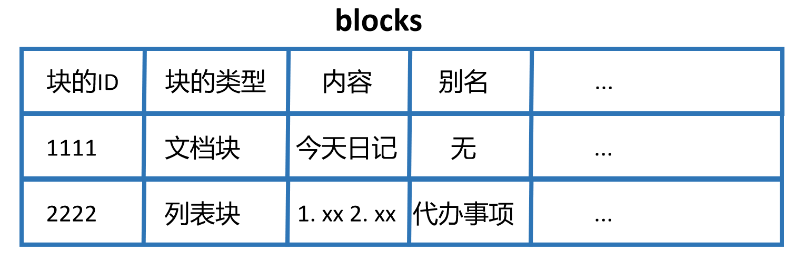

　　看起来像不像 excel？没错，你完全可以把数据库理解成一个 excel 文件。

* 数据库就是：excel 文件
* 数据表就是：excel 里各个 sheet
* 实体就是：每个 sheet 里列的定义，代表了这个 sheet 记录了什么
* 数据就是：表格里每一行

　　虽然数据库可以理解为 excel，但是他不是 excel。excel 可以用 office 软件打开，可视化的编辑，但是数据库不行，他的直接用户不是人，而是计算机程序。所以他没有提供原生的可视化软件用来查询编辑，而是提供了一个名为 SQL 的编程语言来访问内部的数据。

　　总结一下就是：

* 思源运行的时候，会维持一个数据库
* 思源的块、属性、链接什么的，都是独立存储在数据库中表里面
* 为了访问这个表当中的数据，我们需要使用 SQL 语言来查询数据表

　　只有块才是一个实体吗？非也，思源的抽象做的是很好的。双向链接也是一个实体——它有一数据表「refs」；块属性也是一个实体——它有一个数据表「attributes」。这些表都是可以放到 SQL 查询语句里的。

　　我把常用的三个表的定义放在附录里了，需要的可以自行翻阅。

## 1 给菜鸟的 SQL 基本指南

　　SQL 的用法非常灵活，但是灵活往往等价于复杂。于是有的没有计算机背景，但是又希望尝试的萌新们试着搜索某些教程——结果，进去之后发现乱七八糟看不懂，瞬间劝退。

　　实际上，希望在思源里面使用 SQL 的新人们大可不必抱着一个「SQL 从入门到入土」从头读到尾，**思源中实际上会用到的 SQL 查询的语法根本没有那么多**。我下面列举的几个基本语法可以应对 95% 的场景。

* 基本查询

  * select 语句：所有场景都会用到
  * where 语句：绝大部分场景下都会用到
* 嵌套查询：高级用法

### 1.1 基本查询

　　你在思源中用到的所有查询都属于 SQL 中的 `select`​ 查询，如果你去翻阅一个正规 SQL 教程，他们会告诉你 select 语法的定义如下。
其中 column1, column2, ...是列名，table_name 是要查询的表名称，`<condition>`​ 在这里指代查询的条件。如果要查询所有列，则可以用 * 代替列名。

```json
SELECT column1, column2, ...
FROM table_name
where <condition>;
```

　　在思源里面，一般常用的表以及他们各自的字段的定义，我已经放在附录里面了。需要的可以自行查看。

　　==如果你是纯新人==，对什么「table」「column」完全不明白。你也可以先不用管上面这些复杂的讨论，需要做的很简单：==照抄下面的语句==，然后把 `<condition>`​​ 改成==自己需要的条件==就行了。

```SQL
select * from blocks
where <condition>;
```

　　思源中一个最简单的 SQL 查询如下图所示：

1. 中间靠右的表格就是思源运行时维护的数据库中 blocks 表，存储了一切块的信息
2. 我们通过 `<condition>`​ 来匹配到我们希望的块
3. 把这些匹配的块取出来，交给思源进行渲染（或其他处理）

　　这就是 SQL 的基本流程，可见编写 SQL 最关键的就是要会编写 `<condition>`​

　　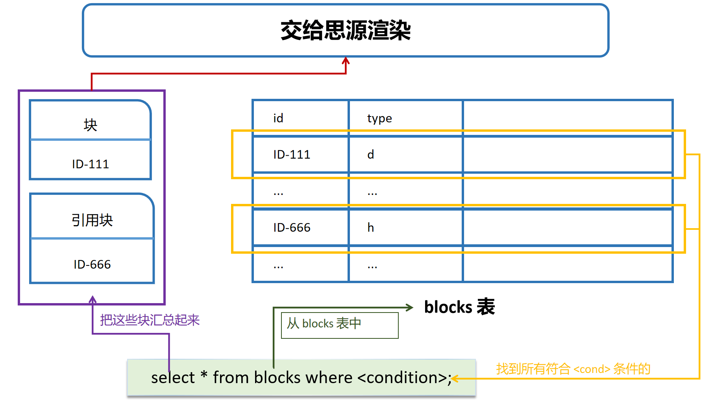

　　那么 `<condition>`​ 是什么鬼？它在 SQL 里面被称为「查询条件」。具体语法我们一步一步来

1. 最基本的条件长这个样子

    ```sql
    type = 'd';
    ```

    * 左边的 `type`​​ 我们把它称为 key

      有时候你会看到 key 周围有 `` 包裹，这个是 SQL 语法的习惯，不用纠结
    * 右边的 `'d'`​​ 我们称为 value

      value 周围包围有 '' 是因为这是一个字符串值，也不用纠结
    * 中间的 `=`​​ 被称为比较操作符，还有其他很多别的操作符：

      * ​`=`​​ 代表了相等
      * ​`<`​​ 代表了小于
      * ​`>`​​ 代表了大于
      * ​`!=`​​ 代表了不相等
      * ​`like`​​ 代表了字符串模板匹配

    所以，这个条件的含义是：要求块的 type 字段等于 'd'。

    type 字段是思源 blocks 表中内置的一个字段，表示的含义是「块的类型」，决定了一个块到底是文档块还是列表块还是其他，而 'd' 表示为文档块。所以，如果我们写出来这么一个 SQL 语法。

    ```sql
    select * from blocks
    where type = 'd';
    ```

    那么得到的结果就是：选择所有 type 为 d（也就是类型为文档）的块。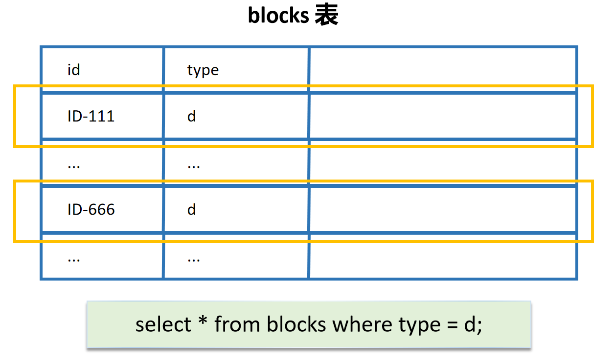

    ‍
2. 组合：使用 and

    条件肯定不能只有一个就行，总归是需要组合才行的。比如我们不光想要查询所有的文档块，还想要查询「所有的创建日期在 2023 年 4 月之后的文档块」——显然这就需要 and 来组合了。

    首先我们来看看，「2023 年 4 月之后」这个条件要怎么表述呢？思源中有一个属性 `created`​​ ，表示一个块是什么时候创建的，他的值的格式为 `20210104091228`​​，我们依样画葫芦，「2023 年 4 月之后」就是应该写作：「`created`​​ > '20230401000000'」。

    而为了把这两个条件组合起来，我们可以使用 `and`​​ 语句： `<cond1> and <cond2>`​​，最后的 sql 查询写成这样：

    ```SQL
    select * from blocks
    where type = 'd' and created > '20230401000000';
    ```

    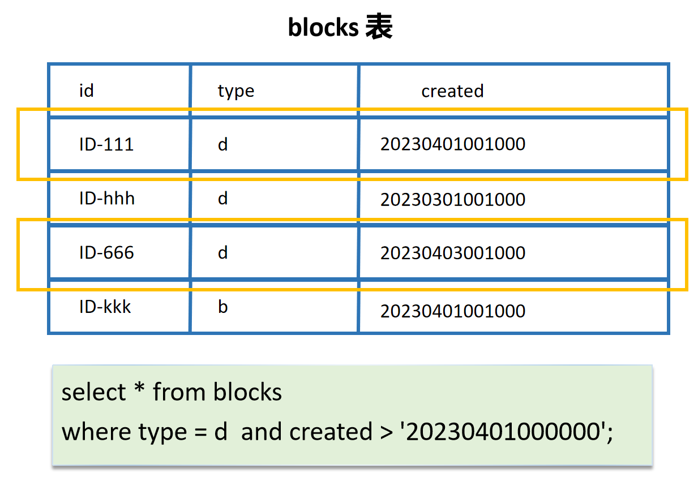
3. 组合：使用 or

    and 组合意味着「条件 A 和 条件 B 必须同时满足」。再思源的实践中，and 查询在绝大部分情况下都够用了。但是偶尔，我们可能也希望做这样的查询「条件 A 或 条件 B 至少满足一个」。这种情况下，就要使用 or 组合了。

    假设我们需要查询所有的二级和三级标题，显然这个条件可以写为「标题级别为二级 或者 标题基本为三级」，于是可以使用以下 SQL 语句：

    ```sql
    select * from blocks
    where subtype = 'h2' or subtype = 'h3';
    ```
4. and 和 or 组合使用：注意优先级问题

    当我们要做比较复杂的查询，需要同时使用 and or 的时候，就要注意符号优先级的问题了，比如下面这个例子

    ```sql
    cond1 or cond2 and cond3
    ```

    请问是先查询 `cond1 or cond2`​​ 然后和 `cond3`​​ 求交集呢？还是 `cond1`​​ 和 `cond2 and cond3`​​ 求并集呢？

    所以为了避免这种混淆情况，请为复杂的条件加上括号来区分优先级

    ```sql
    (cond1 or cond2) and cond3
    cond1 or (cond2 and cond3)
    ```
5. 神奇的 `LIKE`​​

    在第一节的时候，我们提到了比较符号中有一个 `LIKE`​​，这个符号我们要额外讲一下。思源的数据库项目的数据类型基本都是字符串，因而字符串的比较是很重要的。我们在前面提到过的 `=`​​ 代表的含义是「完全相等」。比如我们前面提到的：

    ```sql
    subtype = 'h3'
    ```

    但是有时候，我们可能希望做一些部分匹配，这个时候就是 `LIKE`​​ 的大显身手之处了。它用于匹配一种模式，用法和 `=`​​ 类似也是：

    ```sql
    key like value;
    ```

    但是同 LIKE 操作符匹配的 value 里，通常会使用通配符。通配符是一种特殊字符，可以匹配任意字符或一组字符。最常用的通配符有两个：

    * ​`%`​​：匹配零个或多个字符。
    * ​`_`​​：匹配单个字符。

    举个例子：我们希望搜索创建日期在 2023 年 4 月 1 日的文档块，就可以这么做：

    ```sql
    select * from blocks
    where type = 'd' and created like '20230401%';
    ```

    原本 created 字段的格式有很长一段，'0401' 后面还有时分秒之类的信息，但是使用通配符 `%`​​ 就可以把这些无关紧要的信息全部省略，可以说很方便了。

    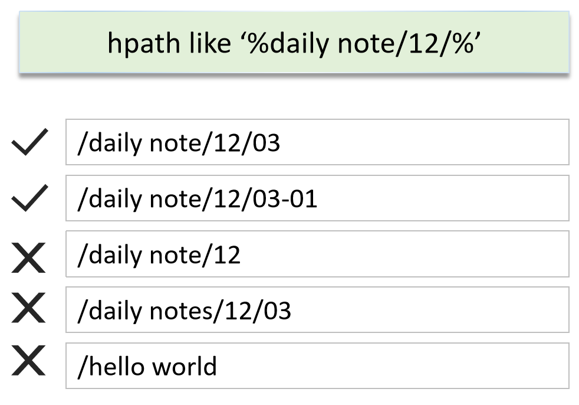

　　‍

### 1.2 嵌套查询

　　基本的 select + where 的查询在大部分简单的查询场景下都是够用的了的。但是如果涉及到双链，那么就不得不使用嵌套查询了。

　　思源笔记对双向链接的支持非常好，那么这个支持是如何体现在数据结构里的呢？在思源笔记的数据库中维护了一个 refs 表专门用来表示链接关系，双向链接就是通过 refs 表中的 `def_block_id`​ 和 `block_id`​ 两个字段来表示的。这两个字段分别指向了被引用的块和引用该块的块的 id。这样，我们可以通过 refs 表来查询两个块之间的关系。

　　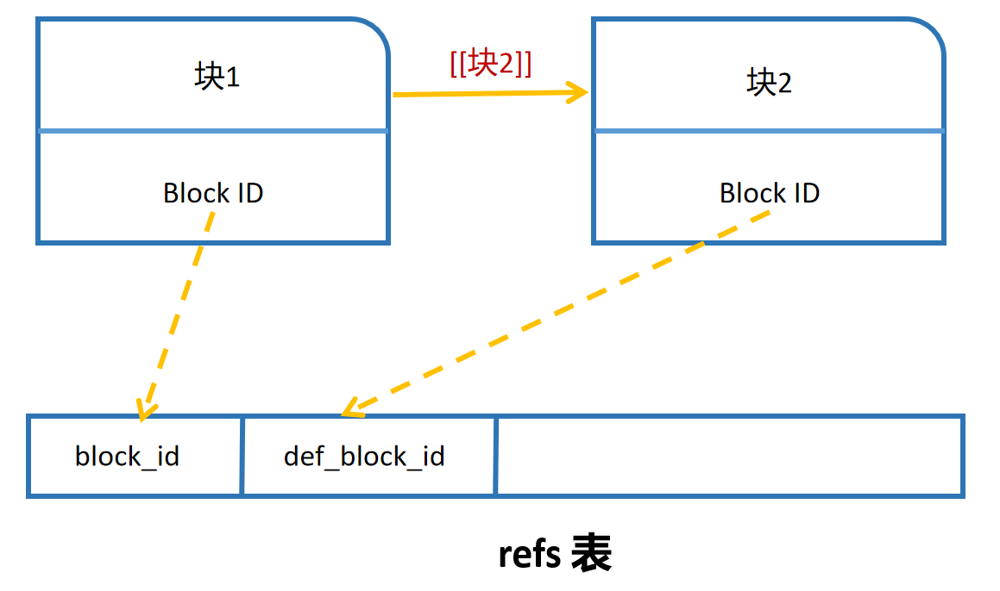

　　嵌套查询可以被看作是一个查询语句作为另一个查询语句的一部分。它的执行顺序是

* 先执行内部的查询
* 然后将内部查询的结果作为外部查询的条件进行查询

　　我们无需深入理解其中的设计逻辑，对于萌新用户而言，只需要记住下面这个模板就行了：

```sql
select * from blocks where id in (
    select block_id from refs def_block_id = '特定笔记块的id'
);
```

　　在这个查询语句中：

* (...) 内部的 select 查询的结果是所有引用特定笔记块的笔记块的 id，我们可以把它想象成一个集合
* 外部查询使用 IN 关键字将其作为外部查询的条件之一

　　于是这个语句可以被直观理解为

1. 先查询所有引用特定笔记块的笔记块的 id

    ```sql
    select block_id from refs def_block_id = '特定笔记块的id'
    ```

    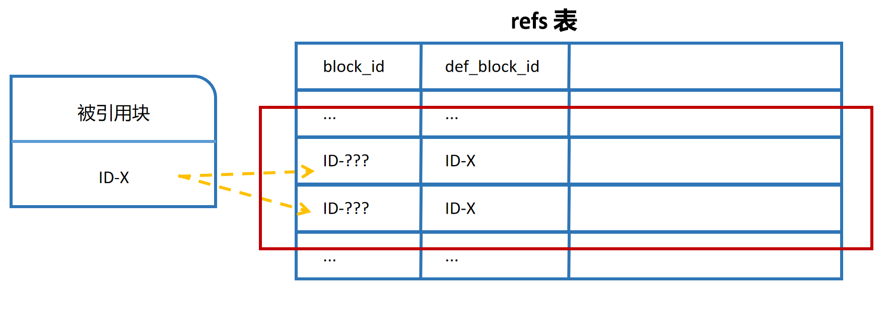
2. 然后根据这些 id 查询对应的笔记块

    ```sql
    select * from blocks where id in <上一步查询的 id 集合>
    ```

    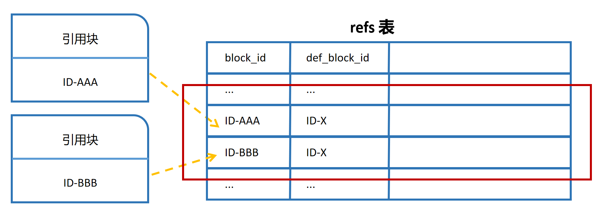

　　需要注意的是，虽然我们这里给的例子中，被嵌套的是 refs 表，但是不代表只能嵌套 refs 表。blocks 和 blocks 表也是可以嵌套在一起的。

### 1.3 其他高级语法

　　基本上对思源笔记的查询来说，有了基本查询 + 嵌套查询，可以应对绝大部分场景。不过还有一些可能会用到的高级语法，我在这里罗列一下，有兴趣的自行去学习：

* ​`union`​ 查询：用于将多个查询结果合并为一个结果集。
* ​`order by`​：用于对查询结果按照指定的列进行排序。
* ​`limit`​：用于限制查询结果的数量。
* ​`group by`​：用于将查询结果按照指定的列进行分组。
* ​`having`​：用于在 `group by`​ 后筛选分组结果。
* ​`join`​​：用于将多个表的数据连接起来查询。

## 2 常用 SQL 查询示例

* 查询所有文档块

  ```sql
  select * from blocks where type='d'
  ```
* 查询所有二级标题块

  ```sql
  select * from blocks where subtype = 'h2'
  ```
* 查询某个文档的子文裆

  ```sql
  select * from blocks
  where path like '%/当前文档id/%' and type='d'
  ```
* 随机漫游某个文档树下所有标题块

  ```sql
  SELECT * FROM blocks
  WHERE root_id LIKE '文档 id' AND type = 'h'
  ORDER BY random() LIMIT 1
  ```
* 查询含有关键词「唯物主义」的段落块

  ```sql
  select * from blocks
  where markdown like '%唯物主义%' and type ='p'
  ORDER BY updated desc
  ```
* 查询过去 7 天内没有完成的任务

  ```sql
  SELECT * from blocks
  WHERE `type` = "l" AND `subtype` = "t"
  AND `created` > strftime('%Y%m%d%H%M%S', datetime('now', '-7 day')) 
  AND markdown REGEXP "\* \[ \] \S+"
  AND `parent_id` not in (
    select `id` from blocks where `subtype` = "t"
  )
  ```
* 查询某个块所有的反链块

  ```sql
  select * from blocks where id in (
      select block_id from refs def_block_id = '当前块的id'
  );
  ```
* 查询某个文档下属的文档树内所有的反链

  ```sql
  select * from blocks where id in (
      select block_id from refs where def_block_id in (
        select id from blocks where path like "%当前文档块 id%"
      )
  )
  ```
* 查询某个书签下所有的块

  ```sql
  select * from blocks where id in (
      select block_id from attributes
      where name = 'bookmark' and value = '书签名'
  );
  ```

## 3 使用 Query 挂件

　　Query 是思源元老级别的挂件，由热心用户[Zuoqiu-Yingyi](https://github.com/Zuoqiu-Yingyi "Creator")（Dark+ 主体作者）提供，让我们为他鼓掌👏👏👏。

　　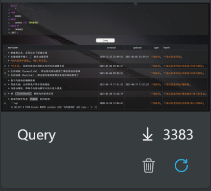

　　Query 挂件解决了两个很重要的问题：

1. Query 为查询结果提供了嵌入块视图之外的表格视图
2. Qeury 让 SQL 查询目标不再只局限于 `select * from blocks`​

### 3.1 Query 提供了表格视图

　　首先来看看第一个问题，我在之前提到过「SQL 为用户提供了直通软件底层的访问能力」。这个说法其实是不严谨的，思源本体并没有给用户提供这么高的访问能力。原因在于，思源本体中，使用 SQL 查询的主要手段是使用嵌入块，而嵌入块虽然会执行 SQL 语句，但是他并不会把查询的结果（表格数据）返回给用户，而是会直接根据查询的结果把对应的块渲染到编辑器中。

　　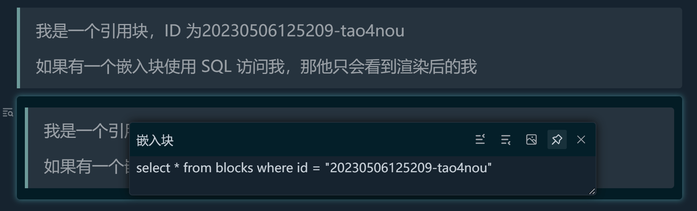

　　但是，如果使用 Query 挂件，就可以访问到原始的数据库信息。

　　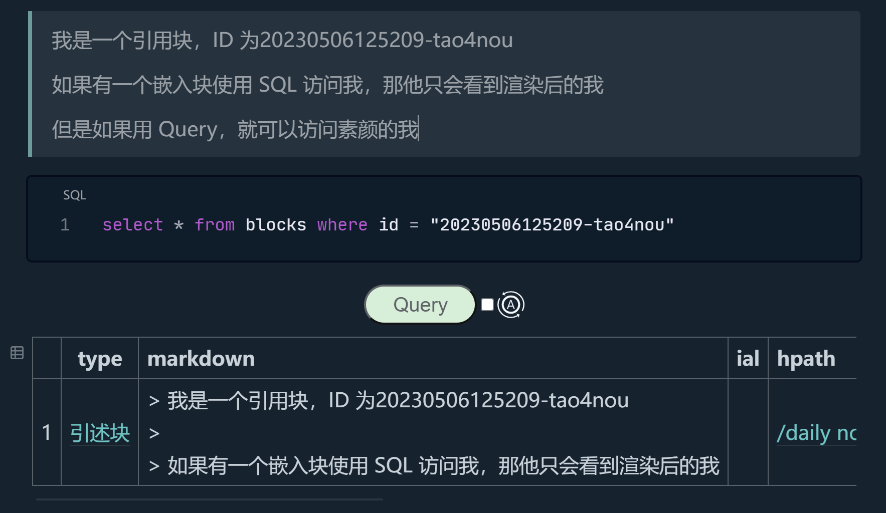

　　‍

### 3.2 Query 让查询更加多样

　　由于思源本体只提供了嵌入块 SQL 查询，就带来了另一个缺点：他不能查询那些无法被前端渲染出来的信息。

　　还记得，我在一开始介绍 SQL 语法的时候告诉大家，`select * from blocks`​ 这个语句不用管直接无脑套用就行了吗？原因在于嵌入块的查询最终的结果是要渲染成可以编辑的块的，所以：

1. 只能查询 blocks 表 `from blocks`​，其他的表查询了也渲染不了
2. 只能查询所有字段 `select *`​，如果字段缺失，嵌入块没法渲染一个完整的块

　　但是使用了 query 就不是问题，在这里，你可以自由发挥，你可以只查询某些字段：

　　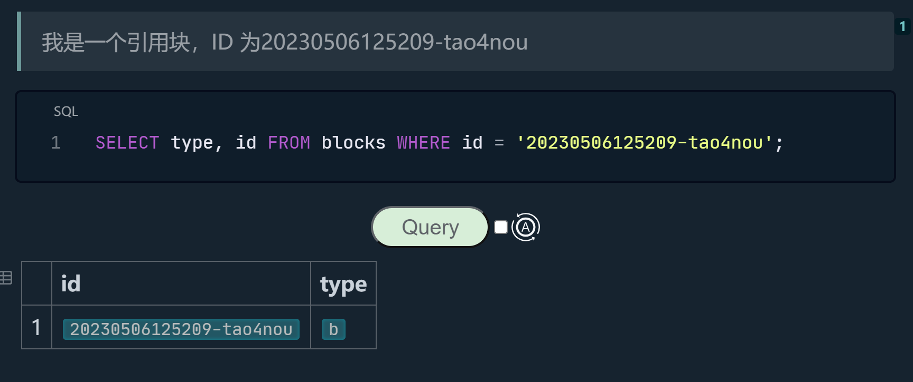

　　 也可以查询 blocks 以外的表：

　　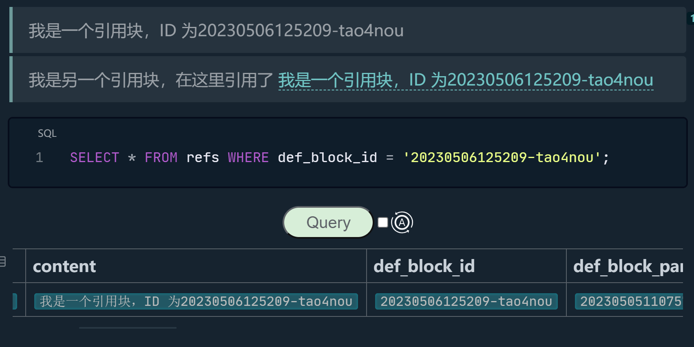

　　 可以说，有了 query 挂件的 SQL 查询，才是满血状态的。

　　当然目前思源正在开发的属性视图不知道会不会有额外的 SQL 支持，拭目以待吧。

　　‍

## 4 使用模板

　　每次都要编写长长的 SQL 语句好麻烦呀！有没有方便一点的办法？

　　有——使用思源的模板。定义一个思源的模板非常简单，只需要在 `data/templates`​ 目录下创建若干 md 文件，这些 md 文件就可以作为模板导入思源。（当然为了方便管理，还是建议大家先创建一个文件夹，把自己的模板放到这个文件夹里面）。

### 4.1 在模板中预先定义 SQL

　　如果你嫌弃每次敲击复杂的 SQL 语法很麻烦，完全可以预先把 SQL 语句写在模板当中，比如现在我在新建的模板 001.md 中写入如下文本。

```md
{{SELECT * from blocks_esc_newline_WHERE `type` = &quot;l&quot; AND `subtype` = &quot;t&quot;_esc_newline_AND `created` &gt; strftime('%Y%m%d%H%M%S', datetime('now', '-7 day')) _esc_newline_AND markdown REGEXP &quot;\* \[ \] \S+&quot;_esc_newline_AND `parent_id` not in (_esc_newline_  select `id` from blocks where `subtype` = &quot;t&quot;_esc_newline_)_esc_newline_ORDER BY `created` DESC}}
```

　　​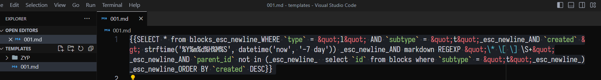​

　　上面的模板定义了一个嵌入块，嵌入块里的 SQL 是之前提到过的，查询过去七天内没有完成的任务。注意，嵌入块的代码必须写在一行内，不能换行。

　　现在在思源里面敲击 `/`​ 导入模板，立刻就可以把这个嵌入块快速导入进来：

　　

　　‍

### 4.2 在模板中定义 Query 模板

　　模板的功能是很强大的，可以导入嵌入块，也可以导入 Query 挂件（前提是你要安装了这个挂件）。现在我们更改 001.md 的内容做一个挂件的模板。

```md
‍‍‍‍```sql
select * from blocks where type = 'd' and created > '20230501000000';
‍‍‍‍```
{: custom-type="query-code"}

<iframe src="/widgets/Query" data-src="/widgets/Query" data-subtype="widget"></iframe>
{: custom-query-fields="[&quot;type&quot;, &quot;content&quot;, &quot;hpath&quot;, &quot;memo&quot;, &quot;box&quot;]" custom-type="query-widget" custom-query-limit="&quot;len&quot;" custom-query-maxrow="2" custom-query-maxlen="20"}
```

　　现在再次导入，你就可以看到一个 Query 挂件了。

　　​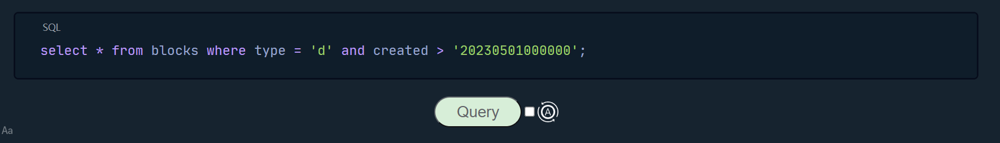​

　　有些人可能会对上面给的 markdown 模板有些迷惑，觉得这似乎不是自己印象中的 markdown —— 你说的对，这其实是一种叫做 kramarkdown 的语法，他是对 markdown 的扩展。看到那个奇怪的 `{:  }`​ 语法了吗，它可以为近邻的 markdown 元素定义一些额外的属性，而思源会把这些属性作为块的属性一起导入。，举个例子，上面提到的 sql 代码块：

```md
‍```sql
select * from blocks where type = 'd' and created > '20230501000000';
‍```
{: custom-type="query-code"}
```

　　如果我们导入了模板后，尝试点击上面那个 SQL 代码块，就会发现这个自定义属性也导入进来了。（思源中以 `custom-`​ 开头的属性会被当作用户定义的自定义属性）

　　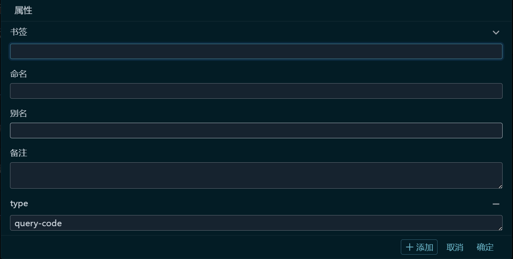

　　‍

　　‍

### 4.3 模板的高级用法

　　如果我们想要定义一个模板，可以查询当前文档的反向链接，也许可以这么编写：

```md
‍```sql
select * from blocks where id in (
    select block_id from refs where def_block_id = '这里填写文档 ID'
) order by `updated` desc
‍```
{: custom-type="query-code"}

<iframe src="/widgets/Query" data-src="/widgets/Query" data-subtype="widget" border="0" frameborder="no" framespacing="0" allowfullscreen="true" style="width: 374px; height: 37px; border: none; background-color: transparent;"></iframe>
{: custom-query-fields="[&quot;type&quot;, &quot;content&quot;, &quot;hpath&quot;, &quot;memo&quot;, &quot;box&quot;]" custom-type="query-widget" custom-query-limit="&quot;len&quot;" custom-query-maxrow="2" custom-query-maxlen="20"}
```

　　然后导入模板后，只需要更改正确的文档 ID 就行了。

　　但是实际上不用这么麻烦，思源的模板支持一些高级的编程特性，关于这一部分，思源内置的文档有详细的描述。如果你不在乎更高级的用法的话，那么记住一下两个语法就够了：

* ​`.action{.id}`​：它会被渲染为模板所在文档的 id
* ​`.action{.title}`​：它会被渲染为模板所在文档的标题

　　现在改写我们的模板如下，导入后，它可以直接查询本文档所有的反向链接。

```md
‍```sql
select * from blocks where id in (
    select block_id from refs where def_block_id = '.action{.id}'
) order by `updated` desc
‍```
{: custom-type="query-code"}

<iframe src="/widgets/Query" data-src="/widgets/Query" data-subtype="widget" border="0" frameborder="no" framespacing="0" allowfullscreen="true" style="width: 374px; height: 37px; border: none; background-color: transparent;"></iframe>
{: custom-query-fields="[&quot;type&quot;, &quot;content&quot;, &quot;hpath&quot;, &quot;memo&quot;, &quot;box&quot;]" custom-type="query-widget" custom-query-limit="&quot;len&quot;" custom-query-maxrow="2" custom-query-maxlen="20"}


```

　　‍

## 附录：思源的 SQL 表字段定义

　　这里只列举了 blocks refs 和 attributes 表，主要是 SQL 查询我就没有遇到过需要用到别的表的情况。更何况其他的表知道的人没有必要看这个教程，看这个教程的人也没有必要知道

　　如果你希望知道完整的数据库里所有表的定义，请查看社区自来水厂的[语雀笔记](https://www.yuque.com/siyuannote/docs/go7uom)（我记得上面有）。

### blocks 表

　　该表用于存储内容块数据。

|字段名|说明|字段值示例|
| ------| --------------------------------------------| ----------|
|​`id`​|内容块 ID|​`20210104091228-d0rzbmm`​|
|​`parent_id`​|双亲块 ID，如果内容块是文档块则该字段为空|​`20200825162036-4dx365o`​|
|​`root_id`​|文档块 ID|​`20200825162036-4dx365o`​|
|​`hash`​|​`content`​ 字段的 SHA256 校验和|​`a75d25c`​|
|​`box`​|笔记本 ID|​`20210808180117-czj9bvb`​|
|​`path`​|内容块所在文档路径|​`/20200812220555-lj3enxa/20210808180320-abz7w6k/20200825162036-4dx365o.sy`​|
|​`hpath`​|人类可读的内容块所在文档路径|​`/0 请从这里开始/编辑器/排版元素`​|
|​`name`​|内容块名称|​`一级标题命名`​|
|​`alias`​|内容块别名|​`一级标题别名`​|
|​`memo`​|内容块备注|​`一级标题备注`​|
|​`tag`​|非文档块为块内包含的标签，文档块为文档的标签|​`#标签1 #标签2# #标签3#`​|
|​`content`​|去除了 Markdown 标记符的文本|​`一级标题`​|
|​`fcontent`​|存储容器块第一个子块的内容(1.9.9 添加)|​`第一个子块`​|
|​`markdown`​|包含完整 Markdown 标记符的文本|​`# 一级标题`​|
|​`length`​|​`markdown`​ 字段文本长度|​`6`​|
|​`type`​|内容块类型，参考⸢类型字段⸥|​`h`​|
|​`subtype`​|内容块子类型，参考⸢子类型字段⸥|​`h1`​|
|​`ial`​|内联属性列表，形如 `{: name="value"}`​|​`{: id="20210104091228-d0rzbmm" updated="20210604222535"}`​|
|​`sort`​|排序权重，数值越小排序越靠前|​`5`​|
|​`created`​|创建时间|​`20210104091228`​|
|​`updated`​|更新时间|​`20210604222535`​|

### refs 表

|字段名|说明|字段值示例|
| ------| ------------------------------| ----------|
|​`id`​|引用 ID|​`20211127144458-idb32wk`​|
|​`def_block_id`​|被引用块的块 ID|​`20200925095848-aon4lem`​|
|​`def_block_parent_id`​|被引用块的双亲节点的块 ID|​`20200905090211-2vixtlf`​|
|​`def_block_root_id`​|被引用块所在文档的 ID|​`20200905090211-2vixtlf`​|
|​`def_block_path`​|被引用块所在文档的路径|​`/20200812220555-lj3enxa/20210808180320-fqgskfj/20200905090211-2vixtlf.sy`​|
|​`block_id`​|引用所在内容块 ID|​`20210104090624-c5bu25o`​|
|​`root_id`​|引用所在文档块 ID|​`20200905090211-2vixtlf`​|
|​`box`​|引用所在笔记本 ID|​`20210808180117-czj9bvb`​|
|​`path`​|引用所在文档块路径|​`/20200812220555-lj3enxa/20210808180320-fqgskfj/20200905090211-2vixtlf.sy`​|
|​`content`​|引用锚文本|​`元类型`​|
|​`markdown`​|包含完整 Markdown 标记符的文本|​`((20200925095848-aon4lem "元类型"))`​|
|​`type`​|引用类型|​`ref_id`​|

### attributes 表

|字段名|说明|字段值示例|
| ------| ------------| ----------|
|​`id`​|属性 ID<br />|​`20211127144458-h7y55zu`​|
|​`name`​|属性名称<br />|​`bookmark`​|
|​`value`​|属性值|​`✨`​|
|​`type`​|类型<br />|​`b`​|
|​`block_id`​|块 ID|​`20210428212840-859h45j`​|
|​`root_id`​|文档 ID|​`20200812220555-lj3enxa`​|
|​`box`​|笔记本 ID|​`20210808180117-czj9bvb`​|
|​`path`​|文档文件路径|​`/20200812220555-lj3enxa.sy`​|
